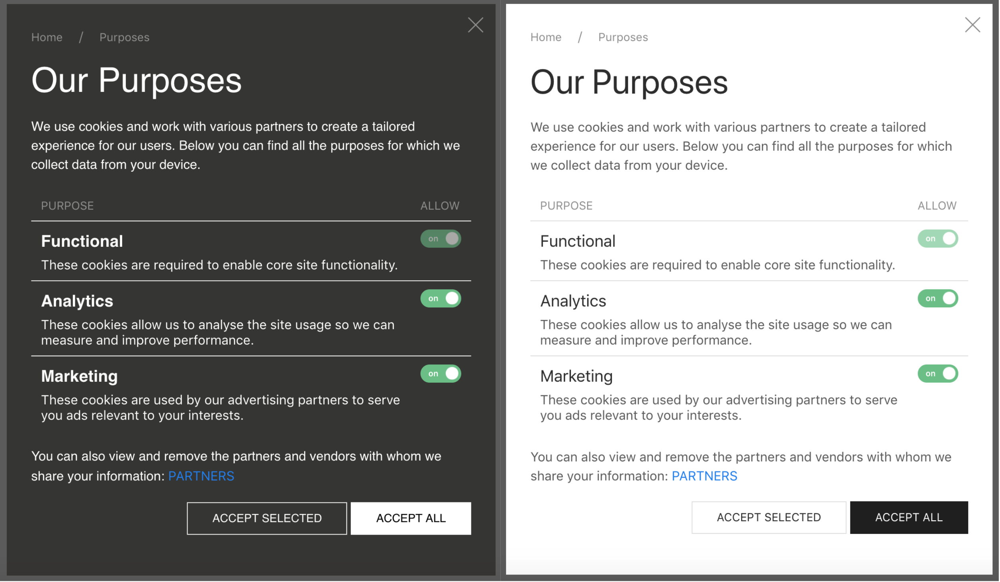

# Customisation Options

Currently we have an on-boarding process in which we will configure the CMP on your behalf, we can customise:
- Messaging
- Styling
    - Shape & size of the modal
    - Text color & font
    - Logo
- Vendor list
- Purpose list

::: tip 
We actively recommend each site to use wording for the consent message which aligns with their brand voice. However, we are happy to provide standard & custom copy. 
::: 

## Custom Style Examples

The world is your oyster when it comes to styling the user interface of the ConsentStack CMP. Most customers opt for bringing the styles in line with the design of the website, this is a service we can perform without any CSS code being shared from your own internal webmaster.

#### Here is a dark and light theme example:

## Consent Notice Wording Examples
**The ConsentStack team have provided some examples of copy which can be used in your modal. We will keep updating this page with new ideas of to keep your CMP text fresh!**

### Example 1

#### We use cookies!
And you should be able to take control over your personal data. Therefore we are providing you with new controls to manage your data, to give you a better internet experience.
If you click **Accept All** below you consent to us and all the third-parties mentioned in our **Privacy and Cookie Notice** setting cookies and processing your personal data for the purposes of analytics and advertising.

### Example 2

#### Welcome to [COMPANY_NAME]
MiQ and our partners use technology such as cookies on our site for analytics and advertising purposes. 
By clicking **I Agree** you consent to use of this technology across the web by us and the third-parties mentioned in our **Privacy Policy**. 
You can change your mind and revisit your consent choices at anytime by returning to this site.

### Example 3

#### About Cookies on This Site
[COMPANY_NAME] may use cookies to remember your log-in details, to optimize site functionality for your use, and deliver marketing based on your interests. Please accept our privacy policy by clicking **I Accept**, or explore further details by clicking **More Information**.