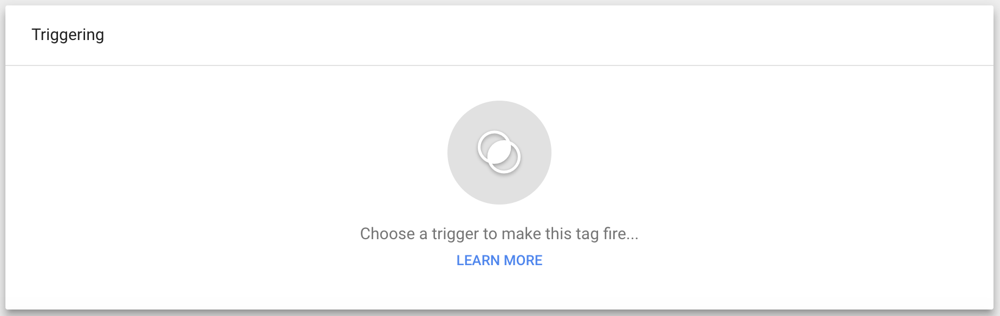
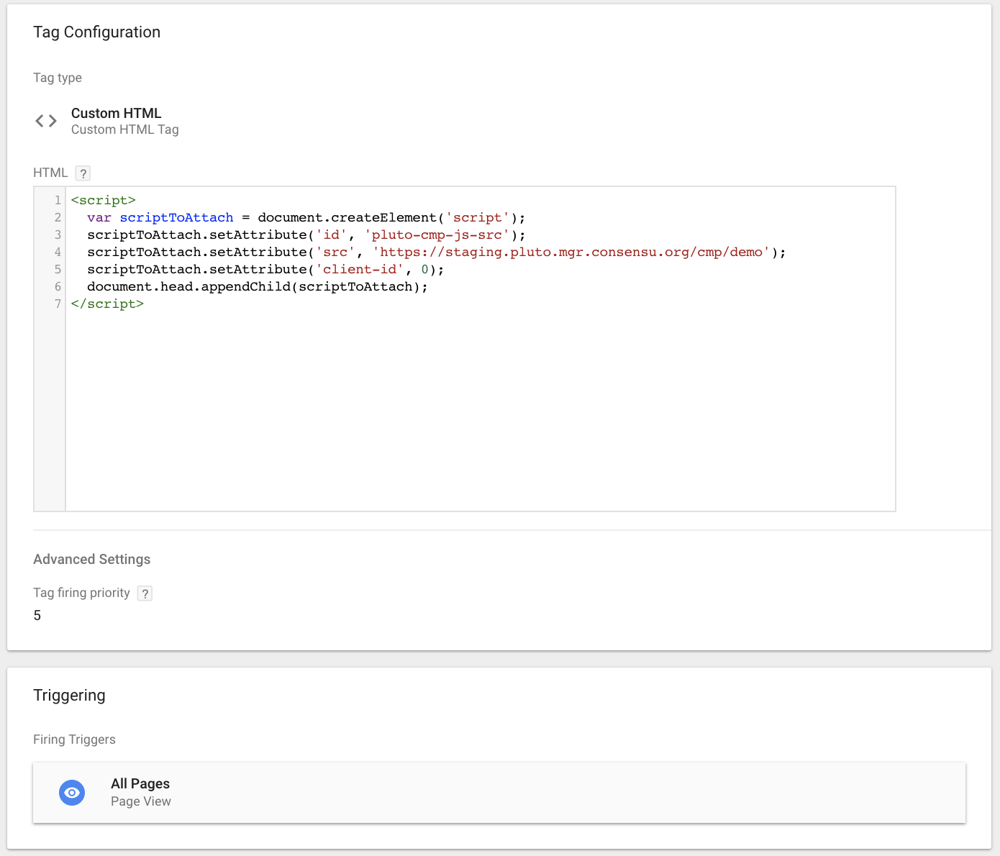
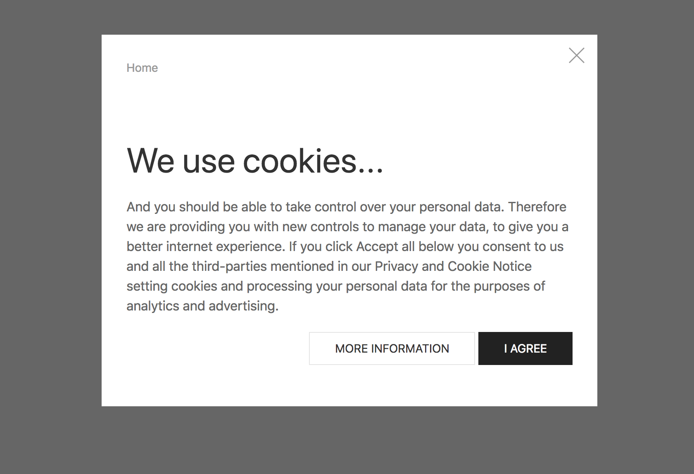
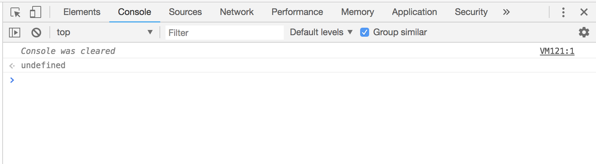

# Installation via a TMS

#### This guide assumes you have read the installation instructions for the basic on-page installation.

The install process through a tag managemenent system (TMS) is extremely simple, the below guide uses [Google Tag Manager](https://www.google.co.uk/analytics/tag-manager/) as an example, but the process would be similar with any other provider. The ConsentStack team would also highly recommend the usage of a TMS for the installation of third party scripts, tags and code to your website as it provides a code-less deployment of any changes, with a very simple process for rollback.

## Non-blocking Installation
You will first need to create a new custom tag, which will house the CMP code:


After clicking "New Tag", you can select the tag type of **Custom HTML**, which will open a screen such as the below:


Now add the following code into the tag manager, making sure to replace `[CLIENT_ID]` with your unique identifier provided by support.

```html
<script>
  var cmp = document.createElement('script');
  cmp.setAttribute('id', 'pluto-cmp-js-src');
  cmp.setAttribute('src', 'https://pluto.mgr.consensu.org/cmp');
  cmp.setAttribute('client-id', [CLIENT_ID]);
  document.head.appendChild(cmp);
</script>
```

Now that you have added the code which will load the CMP, you must select a **trigger** for this code to be executed. Directly below the **Tag Configuration** (where theCMP code has been pasted) you will see the following:



You should select a trigger named **All Pages - Page View** which will load the above CMP code on every page of your website on which the Tag Management System is present. You will now end up with the following:



Do not forget to **Save** and also to **Publish** the changes you have made.

:::tip
It is always advisable to test any changes made to your website in a **testing or staging environment** before it is published on the live website.
:::

You can now visit the URL of your website and will be greeted with your freshly deployed Consent Management Platform, well done!



You should also ensure that the CMP API is also functioning correctly by interacting with it manually in the browser console window.



You can copy and paste the following code, and then hit enter:

```javascript
// create a callback which simply logs any data passed to it
var cb = function(data) { console.log(data) };

// check the status of the CMP, by issuing a ping command
__cmp('ping', null, cb);
```

We expect to receive a response from the CMP with some information on the setup and status:

```json
{
  gdprAppliesGlobally : true, 
  cmpLoaded : true
}
```

**And we are done, time for a tea and biscuit break!**

## Blocking Installation

The CMP also allows for blocking of third party tags until the user has given consent to the necessary purposes and vendors.

:::warning BETA Feature
This feature is currently in **BETA**, and therefore you need to reach out to your account manager to create a custom installation.
:::
