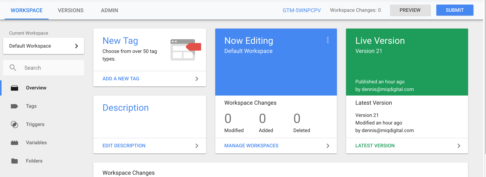
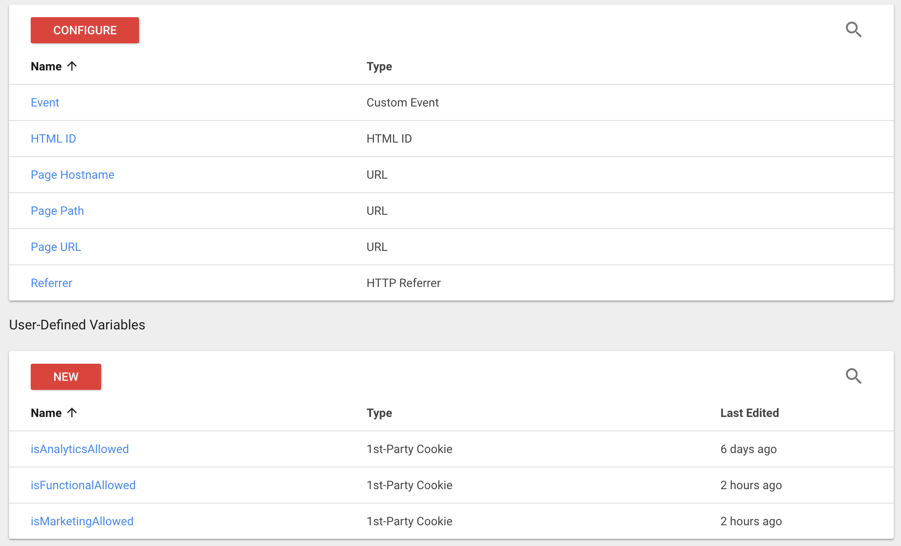
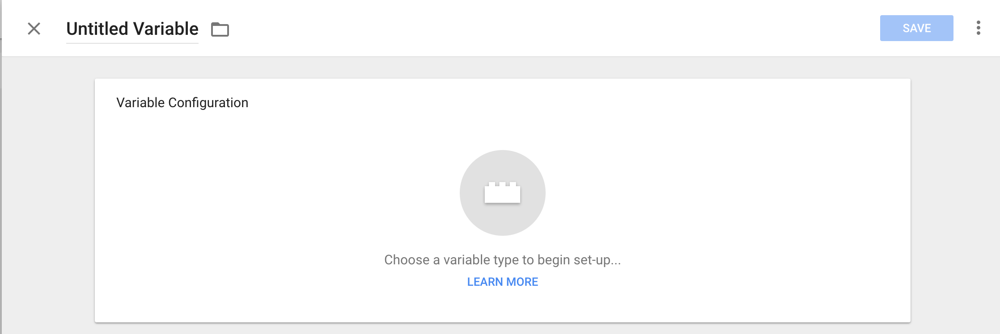
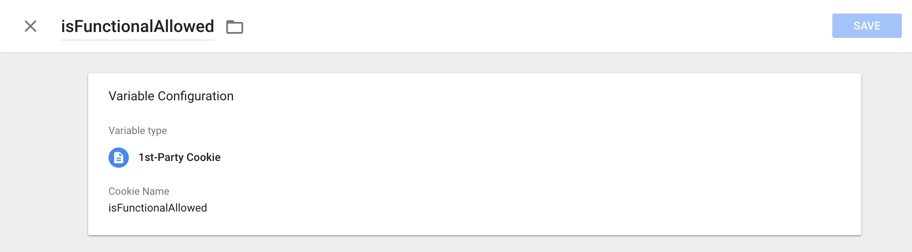
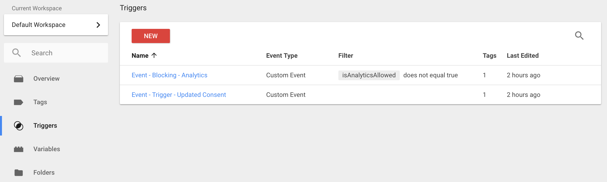
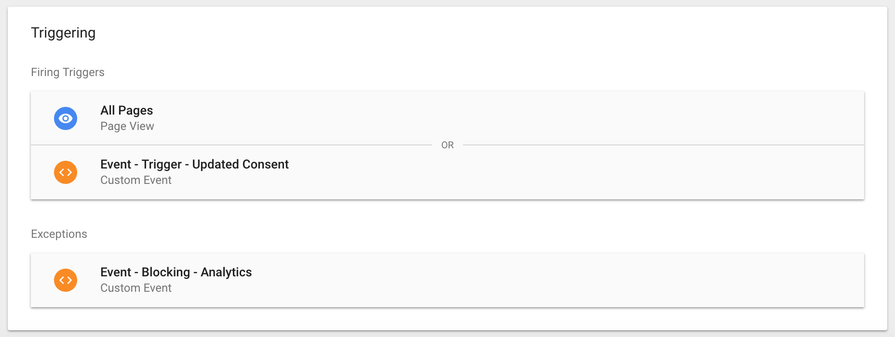

# Installation via a TMS

#### This guide assumes you have read the installation instructions for the basic on-page installation.

The install process through a tag managemenent system (TMS) is extremely simple, the below guide uses [Google Tag Manager](https://www.google.co.uk/analytics/tag-manager/) as an example, but the process would be similar with any other provider. The ConsentStack team would also highly recommend the usage of a TMS for the installation of third party scripts, tags and code to your website as it provides a code-less deployment of any changes, with a very simple process for rollback.

## Non-blocking Installation
You will first need to create a new custom tag, which will house the CMP code:


After clicking "New Tag", you can select the tag type of **Custom HTML**, which will open a screen such as the below:


Now add the following code into the tag manager, making sure to replace `[CLIENT_ID]` with your unique identifier provided by support.

```html
<script>
  var cmp = document.createElement('script');
  cmp.setAttribute('id', 'pluto-cmp-js-src');
  cmp.setAttribute('src', 'https://pluto.mgr.consensu.org/cmp');
  cmp.setAttribute('client-id', [CLIENT_ID]);
  document.head.appendChild(cmp);
</script>
```

Now that you have added the code which will load the CMP, you must select a **trigger** for this code to be executed. Directly below the **Tag Configuration** (where theCMP code has been pasted) you will see the following:


You should select a trigger named **All Pages - Page View** which will load the above CMP code on every page of your website on which the Tag Management System is present. You will now end up with the following:


Do not forget to **Save** and also to **Publish** the changes you have made.

:::tip
It is always advisable to test any changes made to your website in a **testing or staging environment** before it is published on the live website.
:::

You can now visit the URL of your website and will be greeted with your freshly deployed Consent Management Platform, well done!


You should also ensure that the CMP API is also functioning correctly by interacting with it manually in the browser console window.


You can copy and paste the following code, and then hit enter:

```javascript
// create a callback which simply logs any data passed to it
var cb = function(data) { console.log(data) };

// check the status of the CMP, by issuing a ping command
__cmp('ping', null, cb);
```

We expect to receive a response from the CMP with some information on the setup and status:

```json
{
  gdprAppliesGlobally : true, 
  cmpLoaded : true
}
```

**And we are done, time for a tea and biscuit break!**

## Blocking Installation

The ConsentStack CMP allows for blocking of third party tags until the user has given consent to the necessary purposes and vendors. To achieve this functionality we will need to setup a few more bits and pieces in your Google Tag Manager account, but it is very straight foward and requires no technical skills.

For this to work cleanly we must classify our pixels, scripts & tags into three key areas which will also help our website visitors understand how their data will be used.
- **Functional**: These cookies are required to enable core site functionality.
- **Analytics**: These cookies allow us to analyse the site usage so we can measure and improve performance.
- **Marketing**: These cookies are used by our advertising partners to serve you ads relevant to your interests.

:::tip IAB Purpose Categories
Through our testing & feedback we have found that the IAB categories are too obscure for website visitors too understand and only concerned with advertising related trackers. We have therefore placed the IAB purposes within the **Marketing** category, but allow "drill down".
:::

### Let's Begin!

:::warning Hold your horses!
To complete the **blocking** install you must have completed the regular [non-blocking install](#non-blocking-installation) described above.
:::

There are some key concepts in tag management systems such as GTM which will allow for more dynamic functionality. If you want to read up about the [developer portal](https://developers.google.com/tag-manager/quickstart) is a great place to start.

### Create the variables

We must first create some special variables which will hold the consent status of the user for each type of category. When you are in the **Workspace** screen, in the left hand navigation bar, click the **Variables** menu item.



Which will guide you to the following screen.



Here we can create variables ourselves and also configure the pre-defined variables provided by GTM. Click **NEW** in the user defined section.



We now must do the following:
- Give the variable a name: **isFunctionalAllowed**
- Choose the variable type: **1st-Party Cookie**
- Set the cookie name field: **isFunctionalAllowed**

#### Your complete variable will look like the below:



Great work, now repeat this process for two more variables: **isAnalyticsAllowed** & **isMarketingAllowed**.

:::warning Typos
Be wary of typos, the names need to be precise!
:::

### Create the custom triggers

We shall now create two custom triggers to listen to events which will be emmited by the ConsentStack CMP to your webpage.

Navigate to the **Triggers** page from the left navigation bar, and you will end up here:



Create a **NEW** trigger. We will need to complete this process for our three categories to create blocking entries and following that we will create a single update trigger to signify any change made by the user.

#### Blocking Trigger(s)

- Name: `Event - Blocking - Functional`
- Type: `Custom Event`
- Event Name: `.*`
- This trigger fires on: `Some Custom Events` when `isFunctionalAllowed` - `does not equal` - `true`

You now must create two more of these triggers for **Analytics** & **Marketing** triggers, all that is needed is to ammend the name and also the **trigger fires** fields.

#### Update Trigger

We now will create one more trigger to signify an update to the state.

- Name: `Event - Trigger - Updated Consent`
- Type: `Custom Event`
- Event Name: `.*`
- This trigger fires on: `All Custom Events`

#### We are nearly done...

All that is left is to assign the triggers to any GTM **Tags** you would like to become consent aware.

So select a tag and apply rules, the below example shows how we may install an analytics provider such as [Mixpanel](https://mixpanel.com/) on our site. There are two **firing** triggers, a page view trigger which will cause the tracker to load on all pages (in which GTM is also present) & secondly a trigger which fires when the user makes a selection from the CMP. The final piece is attaching a **exception** trigger which is our Blocking event, set to only allow the **Mixpanel** tracker to fire when the user has granted permission for analytics usage of cookie data.



And we are done! Don't forget to reach out to [support](mailto:support@consentstack.org) if any help is needed.

#### Please read the below before rushing off for a :beer:
:::tip Very important notes!
- This process needs to be done once, and applied to any new tags, scripts or pixels you integrate.
- Testing should be done not on the live website (if possible).
- Do not forget to **Save & Publish** your work.
:::