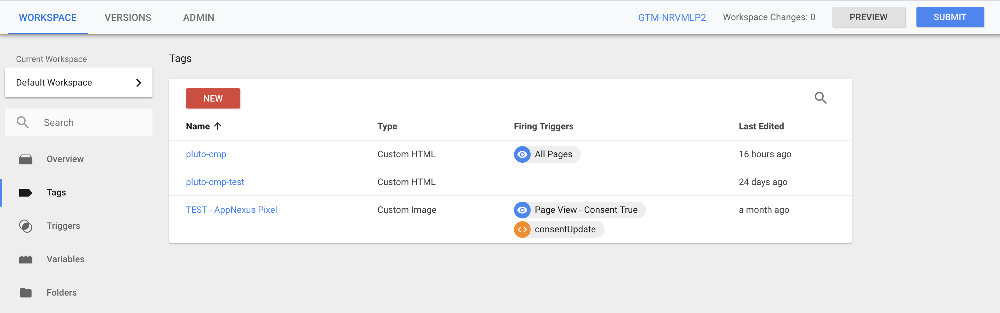
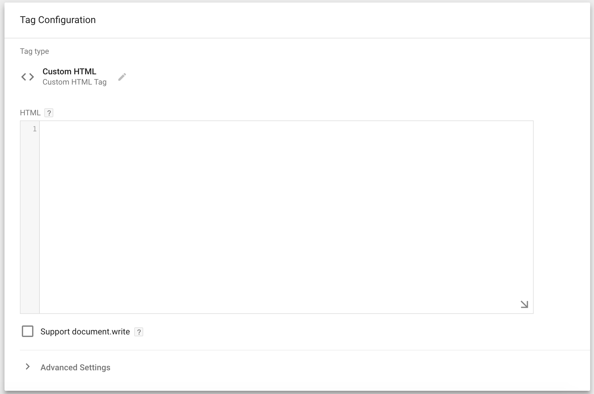

# Tag Manager System Install

#### This guide assumes you have read the installation instructions for the basic on-page installation.

The install process through a tag managemenent system (TMS) is extremely simple, the below guide uses [Google Tag Manager](https://www.google.co.uk/analytics/tag-manager/) as an example, but the process would be similar with any other provider. The ConsentStack team would also highly recommend the usage of a TMS for the installation of third party scripts, tags and code to your website as it provides a code-less deployment of any changes, with a very simple process for rollback.

## Non-blocking Installation
You will first need to create a new custom tag, which will house the CMP code:



After clicking "New Tag", you can select the tag type of **Custom HTML**, which will open a screen such as the below:



Now add the following code into the tag manager, making sure to replace `[CLIENT_ID]` with your unique identifier provided by support.

```html
<script>
  var cmp = document.createElement('script');
  cmp.setAttribute('id', 'pluto-cmp-js-src');
  cmp.setAttribute('src', 'https://pluto.mgr.consensu.org/cmp');
  cmp.setAttribute('client-id', [CLIENT_ID]);
  document.head.appendChild(cmp);
</script>
```

## Blocking Installation

The CMP also allows for blocking of third party tags, until the user has given consent, to the purposes and vendors needed.

:::warning BETA Feature
This feature is currently in **BETA**, and therefore you need to reach out to your account manager to create a custom installation.
:::
